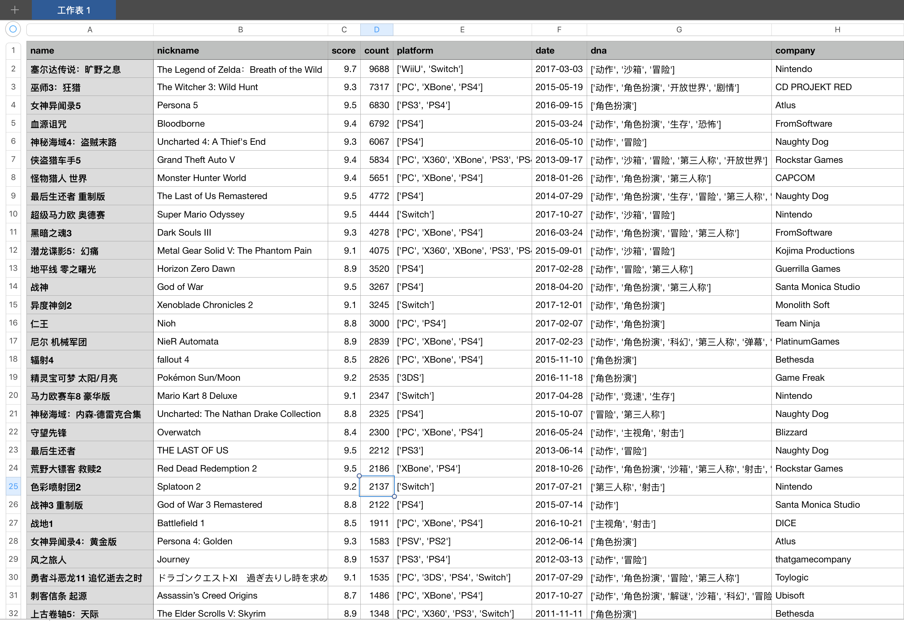

## VGTime 爬虫

### 打开方式

爬虫使用`scrapy`编写，爬取 VGTime 游戏时光 上的游戏库资源。

```bash
# 执行爬虫
scrapy crawl game

# 调试爬虫
调试运行 runner.py 即可
```

### 代码结构

`scrapy`已经将编写爬虫的工作大大简化，你只需要关心两部分：
- 匹配**目标信息和下层链接**（编写XPath表达式）
- 定义爬出来的**数据格式**（编写game_item）

```python
# 数据格式
class GameItem(scrapy.Item):
    name = scrapy.Field()
    nickname = scrapy.Field()
    score = scrapy.Field()
    count = scrapy.Field()
    platform = scrapy.Field()
    date = scrapy.Field()
    dna = scrapy.Field()
    company = scrapy.Field()
    tag = scrapy.Field()
    url = scrapy.Field()
    
# XPath 表达式
game = selector.xpath('//section[@class="game_main"]')
if game:
    game_name = game.xpath(
        'div[@class="game_box main"]/h2/a/text()').extract_first(default='')
    game_nickname = game.xpath(
        'div[@class="game_box main"]/p/text()').extract_first(default='')
    game_score = game.xpath(
        '//span[@class="game_score showlist"]//text()').extract_first(default='-1')
    game_count = game.xpath(
        '//span[@class="game_count showlist"]//text()').extract_first(default="-1")
    game_descri = game.xpath(
        '//div[@class="game_descri"]/div[@class="descri_box"]')
```

其他细节，诸如`模仿浏览器的User Agent`、`使用广度优先遍历`等，都可以在`settings.py`中进行设置。还可以在`pipelines.py`中自定义，拿到`game_item`之后要怎么处理，是直接输出文本还是输入数据库都随你。

作为被调用方，你只需要按需补全自己需要定制的部分即可。一图流，`scrapy`爬虫会主动接管完整的爬取流程：


### 结果解析

我塞尔达天下第一！



看看玩家给塞尔达贴的游戏标签吧，当之无愧：

> '动作', '解谜', '沙箱', '冒险', '神作', '掌机游戏巅峰之作', '开放沙盒', '游戏性趣味性', '巅峰', '沙盒天尊', '细节惊人', '宇宙神作', 'Game Play', '隐藏要素巨多', '秒天秒地秒空气', '超神开创性', '满分并不意味着这个游戏是完美无缺的，给予如此的评价无非是向制作人员对游戏本质的不懈追求表示我们最高敬意！', '无可争议的神作', '不自觉就沉迷其中', '好玩之余还能练习英语', '垃圾，塞尔达秒了', '垃圾，塞尔达秒了它', '无可挑剔的艺术品', '多年以后再议2017还得是她', '捡破烂', '好玩', '真的好好玩啊啊啊', '这是一款为了玩到它值得买一款主机的游戏', '为什么我买了ns，因为我对塞尔达爱得深沉', 'crazy', '几乎完美', '塞尔达天下第一', '最爱', '烟雨未绸缪', '我不叫塞尔达！', '沉浸感', '勇者林克', '任天堂开发的超强作品', '塞尔达系列出色续作', '太牛逼啦！', '时代的艺术品', '肥宅快乐说', '秒了', '世界的主宰', 'rug', '没问题塞尔达！', '因为一个米法  值了', '玩过后让ns吃灰', '割草机林克'

仅供私人研究，商业用途还请联系 VGTime 官方。

